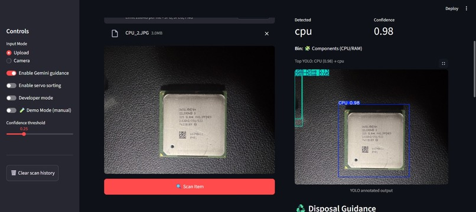
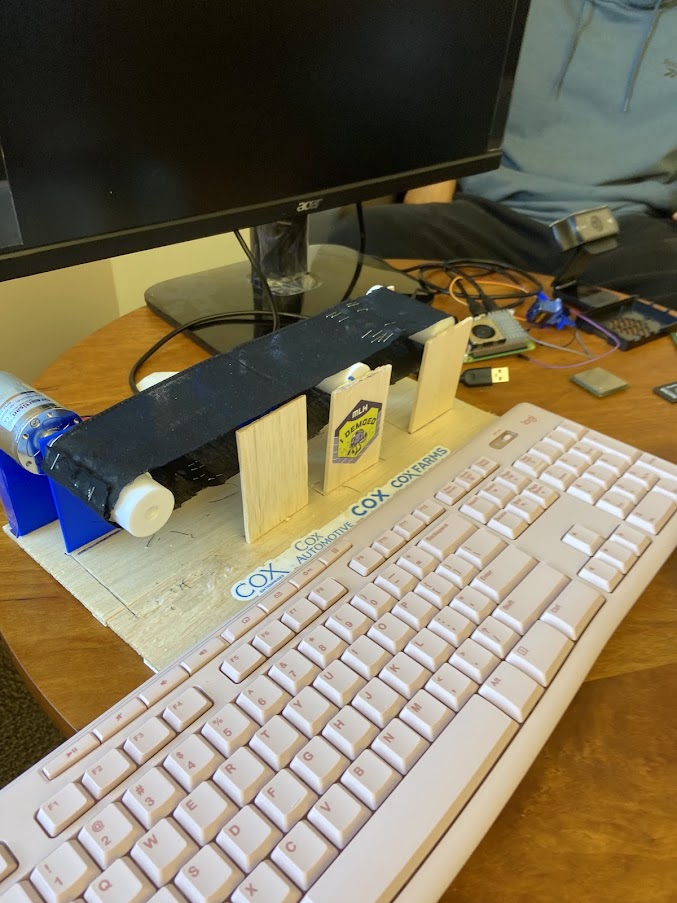

# E-Wizard: Real-Time Computer Vision System for Automated E-Waste Sorting
An end-to-end computer vision system that automatically identifies and sorts electronic waste using a custom YOLOv8 object detection model running on a Raspberry Pi.

**Built with**

`Python` • `YOLOv8` • `OpenCV` • `Streamlit` • `Raspberry Pi` • `Gemini API`

- By: Sohan Kyatham, Zeeshan Ali, Praneel Surath, & Aayan Jamsandekar

## Conveyor Belt

<p align="center">
  
</p>

---

## Images
- The Dashboard


- The Conveyor Belt



## Overview
Electronic waste is one of the fastest-growing waste streams worldwide, yet disposing of it correctly remains confusing and inconvenient. Small electronics often end up in regular trash due to a lack of accessible recycling information.

E-Wizard addresses this problem by combining computer vision, embedded systems, and generative AI into an automated e-waste sorting system. Users simply place an electronic item on the conveyor belt, and the system identifies the object, sorts it into the appropriate bin, and provides disposal guidance through an interactive web dashboard.


## How It Works

1. A webcam captures an image of the object placed on the conveyor belt.
2. A custom-trained YOLOv8 model performs real-time object detection on a Raspberry Pi.
3. The predicted class and confidence score are generated.
4. The Raspberry Pi actuates servo motors to route the item into the correct recycling bin.
5. Detection results are displayed on a Streamlit dashboard.
6. The Gemini API generates educational disposal recommendations tailored to the detected item.


## Key Features

- Real-time object detection using YOLOv8
- Automated sorting with Raspberry Pi controlled servo motors
- Interactive Streamlit dashboard
- AI-generated disposal recommendations using Gemini
- Fully integrated hardware + software pipeline
- Designed for deployment in campus recycling environments


## Tech Stack

### Machine Learning

- YOLOv8
- OpenCV

### Hardware

- Raspberry Pi
- USB Camera
- Servo Motors

### Software

- Python
- Streamlit
- Gemini API

## Architecture & Machine Learning Pipeline
- Camera --> YOLOv8 Inference --> Prediction --> Raspbery Pi GPIO & Servo Motors Sort into Bin along with disposal advice generated on Streamlit dashboard by Gemini

The object detection model was trained using YOLOv8 to recognize common categories of electronic waste.

Inference runs directly on the Raspberry Pi, allowing the system to perform real-time detection without requiring cloud-based computer vision services.

The prediction output drives two downstream components simultaneously:

- Physical sorting through servo motor actuation
- Visualization and disposal guidance in the Streamlit dashboard

This architecture demonstrates the integration of computer vision, embedded systems, and AI-assisted user interfaces into a single end-to-end workflow.


## Installation

## Clone Repository

```bash
git clone [repo]

cd ewizard-ai-sorter
```

## Install Dependencies

```bash
pip install -r requirements.txt
```

## Configure Environment

Create a `.env` file.

```
GEMINI_API_KEY=your_api_key
```

Generate a Gemini API key:

https://aistudio.google.com/app/apikey

## Run

```bash
streamlit run app.py
```

---


## Future Improvements
- Fully integrate the conveyor belt, computer vision pipeline, and servo motor control into a seamless end-to-end autonomous sorting system.
- Expand the training dataset to recognize additional categories of electronic waste.
- Add cloud-based analytics to monitor recycling trends and system performance across multiple deployments.